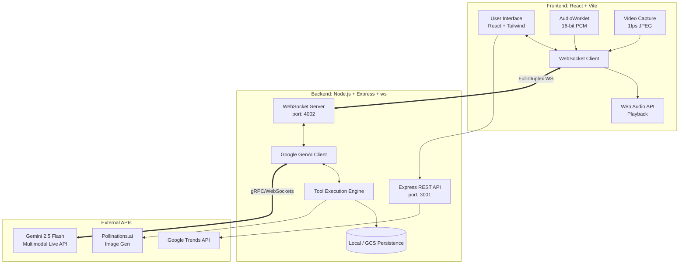

# Style_it Architecture

This document provides a comprehensive overview of the Style_it application architecture, detailing the interaction between the frontend client, the Node.js backend, and the Gemini 2.5 Flash Multimodal Live API.

## System Diagram

---

## Component Breakdown

### 1. Frontend Client
- **Framework**: React 19, built with Vite for fast HMR and optimized builds.
- **Styling**: Tailwind CSS ensures a premium, responsive, and minimalist aesthetic.
- **Real-time Media Processing**:
  - **Audio Input**: Utilizes the Web Audio API with a custom `AudioWorklet` (`mic-processor.js`). It captures microphone input at 16kHz, converts it to 16-bit PCM format, and streams it as base64-encoded chunks over WebSockets. It also includes simple Voice Activity Detection (VAD) to interrupt AI playback when the user starts speaking.
  - **Video Input**: Captures video frames from the user's webcam via the `MediaDevices` API, draws them to an off-screen `<canvas>`, compresses them to low-quality JPEG to save bandwidth, and sends them at ~1 frame per second.
  - **Audio Output**: Receives 24kHz PCM audio chunks from the AI (via the backend) and plays them back dynamically using the `AudioContext` and `AudioBufferSourceNode`.

### 2. Backend Server
- **Runtime**: Node.js with TypeScript (`tsx` for dev execution).
- **REST API (Port 3001)**: Handles user authentication (signup/login) and fetches live styling trends via the `google-trends-api`.
- **WebSocket Server (Port 4002)**: The core bridge between the client and the Gemini Live API. It maintains persistent, stateful connections scoped by `userId`.
- **Gemini Live Client**: Initializes a session with `gemini-2.5-flash-native-audio-latest` utilizing the `@google/genai` SDK. It streams incoming audio/video chunks from the client directly to the model using `sendRealtimeInput()`.
- **Tool Execution Engine**: When the Gemini model issues a tool call (e.g., `generate_style_batch`), the backend intercepts it, processes it (e.g., fetching dynamic images via Pollinations.ai), and sends the result both back to the model and down to the frontend for UI updates.
- **Persistence Layer**: Abstracted data storage that attempts to use Google Cloud Storage (GCS) if configured (`GCS_BUCKET_NAME`), gracefully falling back to local file system JSON storage in a `data/` directory.

### 3. External Integrations
- **Gemini Multimodal Live API**: Processes continuous audio and visual context streams, returning low-latency audio responses and executing JSON-structured tool calls.
- **Pollinations.ai**: Used dynamically within the `generate_style_batch` tool to generate high-quality, prompt-matched fashion editorial images when product URLs are unavailable.
- **Google Trends API**: Fetches real-time search trends to power the "Style Trends" dashboard.

---

## Data Flow: The Multimodal Loop

1. **Initialization**: The user connects to the WebSocket server. The backend initializes a Gemini Live session, injecting the user's current "Target Style" as a system instruction.
2. **Streaming Context**: 
   - The frontend continuously streams microphone audio and 1fps video frames (or an uploaded static image).
   - The backend forwards these media chunks immediately to the Gemini Live session.
3. **Triggering Analysis**: The user issues a text command or speaks. The AI analyzes the multimodal context (seeing the clothes, hearing the voice).
4. **Tool Execution**: 
   - The AI decides to update the UI by calling `update_style_insights` or `generate_style_batch`.
   - The backend executes the function, fetches AI imagery if needed, and broadcasts the `toolCallResult` to the frontend via WS.
5. **Vocal Response**: Simultaneously, the AI streams its vocal coaching back as PCM audio chunks, which the backend routes to the frontend for immediate playback.
6. **Interruption**: If the user speaks during playback, the frontend's VAD halts the local audio buffer, and the backend/model naturally handles the conversational interruption.
